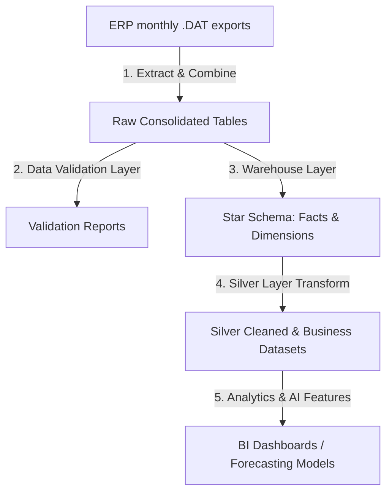
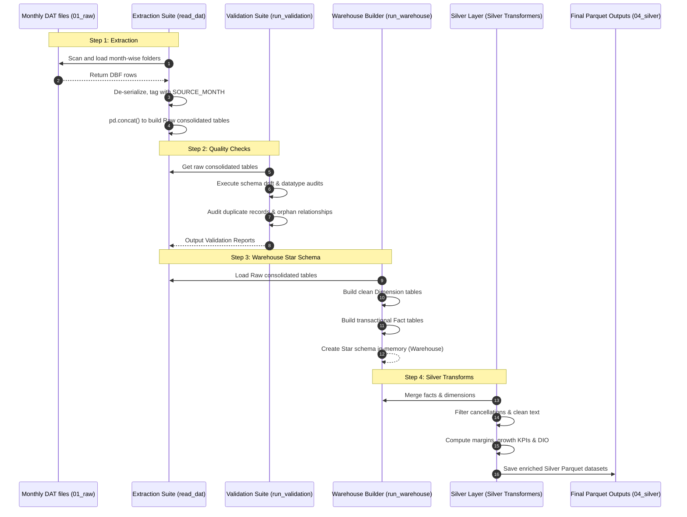

# Finemed Pharma AI Data Warehouse & ETL Pipeline

An AI-powered data warehouse and analytics system designed to extract, validate, model, and transform ERP data from Finemed Pharmaceuticals. The codebase utilizes a medallion-like architecture (Raw -> Staging -> Warehouse -> Silver/Analytics) to build a relational star schema from historical monthly dBase/DBF database exports.

---

## 1. Project Architecture Overview

The system is structured as a modular Python package (`finemed_ai`) that processes historical ERP data through a series of pipeline layers:



### Medallion Data Layers
1. **Raw Layer (`data/01_raw/`)**: Month-wise folder structure containing raw `.DAT` (dBase DBF) database files exported from the ERP system. Each monthly folder represents a point-in-time snapshot.
2. **Staging Layer (`data/02_staging/`)**: Cleaned and combined raw snapshots, indexed and ready for dimensional modeling.
3. **Warehouse Layer (`data/03_warehouse/`)**: Star schema output consisting of de-duplicated, standardized Dimension tables and transaction-aligned Fact tables.
4. **Silver/Analytics Layer (`data/04_silver/`)**: Business-oriented datasets with joined dimensions, cleaned metrics, and engineered features.

---

## 2. Directory Structure

Below is the directory structure layout of the workspace:

```text
D:\Finemed_PharamaAI
├── data/                       # Directory containing medallion layers (ignored by Git except .gitkeep)
│   ├── 01_raw/                 # Input monthly folders (e.g. JAN-18, FEB-18) with .DAT files
│   ├── 02_staging/             # Temporary staging folder
│   ├── 03_warehouse/           # Star schema facts and dimensions (Parquet formats)
│   └── 04_silver/              # Transformed silver business datasets
├── logs/                       # Pipeline run logs
│   └── etl.log                 # Standard logging file
├── scripts/                    # Command-line entry points
│   └── run_etl_pipeline.py     # Main ETL execution script
├── src/                        # Main source code package
│   └── finemed_ai/
│       ├── config/             # Path config mappings (paths.py)
│       ├── extract/            # DBF reader utilities (read_dat.py)
│       ├── transform/          # Silver layer business transformations & metrics
│       │   ├── common/         # Common joins, helpers, and business KPI calculations
│       │   ├── sales/          # Sales silver layer pipeline
│       │   ├── medicine/       # Product/medicine silver layer pipeline
│       │   ├── purchase/       # Procurement silver layer pipeline
│       │   ├── supplier/       # Supplier silver layer pipeline
│       │   └── inventory/      # Stock/inventory silver layer pipeline
│       ├── utils/              # Custom logger utility
│       ├── validation/         # Multi-layered data quality validators
│       └── warehouse/          # Star-schema facts & dimensions builder scripts
├── tests/                      # Testing script scripts (run directly in venv)
│   ├── test_extract.py         # Tests extraction performance & shapes
│   ├── test_validation.py      # Tests complete validation suite (schema, datatype, duplicates, orphans)
│   └── test_warehouse.py       # Tests full dimension and fact table building
├── pyproject.toml              # Build configurations & package dependencies
└── requirements.txt            # Empty file (dependencies defined in pyproject.toml)
```

---

## 3. Data Schema & Architecture Breakdown

### Required ERP Tables (`REQUIRED_FILES`)
The pipeline expects the following 8 `.DAT` files in each monthly folder:
1. `INVOICE.DAT` — Customer sales invoice headers
2. `INVDET.DAT` — Itemized details (lines) for sales invoices
3. `MEDIMAST.DAT` — Medicine/product master catalog
4. `PURCHASE.DAT` — Supplier purchase invoice details (lines)
5. `COMPUR.DAT` — Supplier purchase invoice headers (company purchases)
6. `SUPMAST.DAT` — Supplier master catalog
7. `SFILE.DAT` — Salespersons master file
8. `TFILE.DAT` — Tax rates, slabs, and category codes

---

### Data Validation Layer (`src/finemed_ai/validation/`)

Before constructing the warehouse, raw tables undergo robust validation checks:

* **File Validator (`file_validator.py`)**: Checks for the existence of all required `.DAT` files across monthly folders and flags empty files.
* **Schema Validator (`schema_validator.py`)**: Validates schema drift by comparing column count, names, and presence of columns against a baseline month folder.
* **Datatype Validator (`datatype_validator.py`)**: Ensures that every column's datatype remains uniform throughout the historical monthly slices.
* **Duplicate Validator (`duplicate_validator.py`)**: Scans for duplicate records on composite business keys:
  * `INVOICE`: `SOURCE_MONTH` + `INVNO`
  * `INVDET`: `SOURCE_MONTH` + `INVNO` + `MDCODE` + `BATCH`
  * `MEDIMAST`: `SOURCE_MONTH` + `MDCODE`
  * `PURCHASE`: `SOURCE_MONTH` + `PINVNO` + `MDCODE` + `BAT`
  * `COMPUR`: `SOURCE_MONTH` + `PINVNO`
  * `SUPMAST`: `SOURCE_MONTH` + `SUPNO`
  * `SFILE`: `SOURCE_MONTH` + `SCODE`
  * `TFILE`: `SOURCE_MONTH` + `TCODE`
* **Orphan (Referential Integrity) Validator (`orphan_validator.py`)**: Verifies parent-child relationships (e.g. check if `INVDET` lines map to an existing `INVOICE`, check if `PURCHASE` references an existing `MEDIMAST` product and `COMPUR` header).
* **Data Profiler (`profile_validator.py`)**: Runs column-level statistics mapping null counts, unique metrics, constant columns, and numeric distributions (mean, min, max, median).

---

### Warehouse Layer - Star Schema (`src/finemed_ai/warehouse/`)

The pipeline transforms the combined monthly tables into a structured dimensional data model optimized for BI reporting and analytics:

```
                  +-----------------------+
                  |       dim_date        |
                  +-----------------------+
                  | date_key (PK)         |
                  | full_date, day, week  |
                  | month, quarter, year  |
                  | financial_year        |
                  +-----------+-----------+
                              |
                              |
+-------------------+         |         +-----------------------+
|    dim_product    |         |         |      dim_supplier     |
+-------------------+         |         +-----------------------+
| MDCODE (PK)       |---------+---------| SUPNO (PK)            |
| MDNAME, PACKG     |         |         | SUPNAME, SUPCODE      |
| SUPNO, HSN, UQC   |         |         | RADD1, RPHON          |
+---------+---------+         |         +-----------+-----------+
          |                   |                     |
          |       +-----------+-----------+         |
          |       |   fact_sales_invoice  |         |
          |       +-----------------------+         |
          |       | INVNO (PK)            |         |
          |       | INVDT (FK -> dim_date)|         |
          |       | SCODE (FK)            |         |
          +------>| CCODE, NET_AMT        |<--------+
                  | TOT_AMT, DISC_PER     |
                  +-----------+-----------+
                              |
                              |
                  +-----------v-----------+
                  |    fact_sales_line    |
                  +-----------------------+
                  | INVNO (FK)            |
                  | MDCODE (FK)           |
                  | BATCH (PK), EXP       |
                  | QTY, RATE, MRP, TCODE |
                  +-----------------------+
```

#### Dimensions (`dimensions/`)
1. **`dim_date`**: Time-intelligence calendar table built from `2018-01-01` to `2026-05-31`. It maps day, weekend flags, month name, and custom financial years starting in April (e.g., `FY 2023-24`).
2. **`dim_product`**: Product catalog built from `MEDIMAST.DAT` de-duplicated by product code `MDCODE`.
3. **`dim_supplier`**: Supplier profiles built from `SUPMAST.DAT` de-duplicated by supplier number `SUPNO`.
4. **`dim_salesperson`**: Sales representatives details built from `SFILE.DAT` mapped by `SCODE`.
5. **`dim_tax`**: Tax codes, GST splits (CGST, SGST, IGST) built from `TFILE.DAT` mapped by `TCODE`.

#### Facts (`facts/`)
1. **`fact_sales_invoice`**: Detailed header transactions from `INVOICE.DAT` recording date, salesperson code, gross/net amounts, cancellation IDs, and discounts.
2. **`fact_sales_line`**: Itemized transaction line rows from `INVDET.DAT` recording product code, batch, rate, quantity, MRP, and tax rates.
3. **`fact_purchase_header`**: Purchase headers from `COMPUR.DAT` reflecting invoice dates, supplier numbers, and total invoice values.
4. **`fact_purchase_line`**: Purchase item details from `PURCHASE.DAT` mapping batch numbers, quantity bought, unit rates, MRP, and current stock on hand (SOH).
5. **`fact_invoice_due`**: Customer payment metrics tracking payment due date offsets and balance aging based on sales header records.

---

### Silver Layer Transformations (`src/finemed_ai/transform/`)

The transformation pipelines apply business rules, merge facts with date/product/supplier dimensions, clean anomalies, and compute business KPIs (financial margins, stock metrics, procurement values). 
* Reusable logic for revenue performance (Absolute Profit, Profit Margin %, percentage changes, and Growth Rate) and inventory control (Inventory Turnover, Days Inventory Outstanding/DIO, stock utilization) is defined in `common/business_metrics.py`.
* Individual runners (`run_sales.py`, `run_purchase.py`, `run_inventory.py`, `run_medicine.py`, and `run_supplier.py`) orchestrate clean, join, metrics, and feature engineering tasks, writing the final structured silver datasets to parquet files under `data/04_silver/`.

---

## 4. Execution Flow Diagram



---

## 5. How to Run and Test the Project

### Prerequisites
* Windows, Linux, or macOS environment.
* Python version `3.10.x` or higher installed.

---

### Step 1: Setup Environment & Dependencies
Create and clean the virtual environment, then install the package in editable mode:

```powershell
# Create/Recreate virtual environment
python -m venv venv --clear

# Activate the virtual environment
# Windows:
venv\Scripts\activate.ps1
# macOS/Linux:
# source venv/bin/activate

# Install the codebase package and dependencies in editable mode
pip install -e .
```

*Editable installation installs the `pandas`, `dbfread`, `numpy`, `python-dateutil`, and `pytz` dependencies, registering the `finemed_ai` module locally so scripts are run seamlessly.*

---

### Step 2: Raw Data Placement
The extraction process reads raw `.DAT` database tables from monthly folders. 
* **Folder Path**: `data/01_raw/` in the project root.
* **Layout Structure**:
```text
data/01_raw/
├── APR-18/
│   ├── INVOICE.DAT
│   ├── INVDET.DAT
│   └── ... (all 8 tables)
├── MAY-18/
└── ...
```

*(Note: If running on the local sabari machine, a directory junction has been created pointing directly to the downloads raw data folder: `C:\Users\sabari\Downloads\SIVA_EXTRACTED\SIVAOLD_EXTRACTED\SIVAOLD_EXTRACTED\`. The system runs out-of-the-box.)*

---

### Step 3: Running Test Scripts
We have pre-configured test scripts located in the `tests/` directory to run validation audits and build dimensions:

1. **Extract Test**:
   Validates DBF reading speeds and counts month folders.
   ```powershell
   python tests/test_extract.py
   ```

2. **Validation Layer Test**:
   Runs complete datatype checks, duplicate detection, schema alignment audits, and orphan checks across all 102 months:
   ```powershell
   python tests/test_validation.py
   ```

3. **Warehouse Layer Test**:
   Runs dimension and fact construction in memory and prints shapes of the built tables:
   ```powershell
   python tests/test_warehouse.py
   ```

---

### Step 4: Executing the Pipelines
To execute the pipeline end-to-end, run:
```powershell
python scripts/run_etl_pipeline.py
```
*(You can extend this script to include validation and warehouse builds, or use individual transform executors under `src/finemed_ai/transform/` to build Silver files).*
