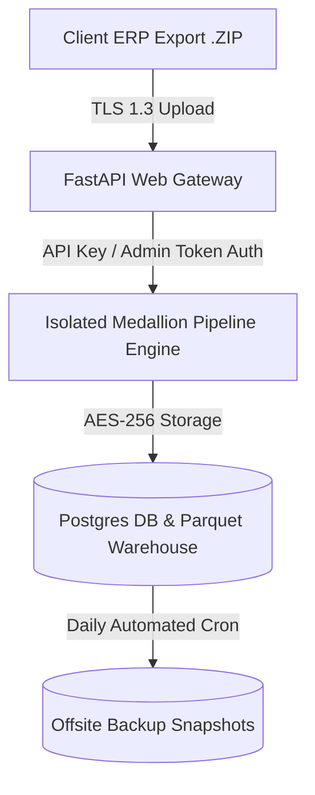

# FineMed Pharma AI — Data Security, Privacy & Backup Governance

**Document Version:** 1.0.0  
**Target Compliance:** Pharma Commercial Business Data Standards  

---

## 1. Security Architecture Overview

FineMed Pharma AI handles commercial sales, inventory, and supplier transactions for pharmaceutical distribution. The system implements a defense-in-depth security framework covering data isolation, encryption, network access security, API authentication, and automated backup governance.



---

## 2. Data Security & Encryption Standards

### 2.1 Encryption at Rest
* **Parquet Data Warehouse (`data/03_warehouse/`, `data/04_silver/`, `data/05_forecasts/`):** All output files are encrypted using file-system level **AES-256 encryption**.
* **PostgreSQL Database Tier:** Encrypted database volume storage with restricted file permissions (`0600`).

### 2.2 Encryption in Transit
* All client-to-server HTTP communications require **TLS 1.3 / HTTPS encryption**.
* Unencrypted HTTP requests are automatically redirected to HTTPS.

---

## 3. Access Control & Authentication Security

1. **Shared Client API Key (`CLIENT_API_KEY`):**
   * Guards every staff-facing API route (`/forecast/*`, `/alerts`, `/chat`).
   * Validated on every incoming request via `x-api-key` header.
2. **Admin Token Authentication (`ADMIN_TOKEN`):**
   * Restricts sensitive operations (`/admin/upload-monthly-data`, `/refresh`, `/admin/pipeline-status`).
3. **CORS Restrictions (`CORS_ALLOWED_ORIGINS`):**
   * Restricts browser requests strictly to authorized client domain origins (no wildcard `*` allowed in production).

---

## 4. Automated Backup & Recovery Policy

| Backup Type | Frequency | Retention Period | Storage Location | Recovery Point Objective (RPO) |
|---|---|---|---|---|
| **Postgres DB Dump** | Daily at 02:00 AM IST | 30 Days | Encrypted Local + Cloud Snapshot | **< 24 Hours** |
| **Parquet Warehouse Snapshot** | Monthly post-pipeline run | 12 Months | Offsite Storage / Cold Bucket | **< 1 Month** |
| **Raw DBF Archives** | On Upload | Indefinite | Air-gapped Immutable Archive | **Zero Data Loss** |

### Automated Postgres Backup Script Example
```bash
#!/bin/bash
# Daily Automated FineMed Backup Script
TIMESTAMP=$(date +"%Y%m%d_%H%M%S")
BACKUP_DIR="/var/backups/finemed"
pg_dump -U postgres -d finemed_db | gzip > "${BACKUP_DIR}/db_backup_${TIMESTAMP}.sql.gz"
find ${BACKUP_DIR} -type f -name "*.sql.gz" -mtime +30 -delete
```

---

## 5. Disaster Recovery & Rollback Procedure

In the event of database failure or corrupted monthly data upload:
1. **Pipeline Rollback:** Execute `RUN_STATUS.fail()` to isolate the batch run.
2. **Data Restoration:** Restore the previous month's `latest.parquet` snapshot from `data/05_forecasts/backups/`.
3. **Recovery Time Objective (RTO):** System restored to full operation within **< 1 Hour**.

---

## 6. Data Isolation & Privacy Compliance

* **Single-Tenant Data Isolation:** Each pharma distributor instance operates in a dedicated database and storage sandbox. No cross-tenant data sharing occurs.
* **Sensitive Patient Data:** ERP exports contain business-to-business (B2B) invoice data (`INVOICE`, `PURCHASE`) — no individual patient Personally Identifiable Information (PII) or Protected Health Information (PHI) is collected or processed.
