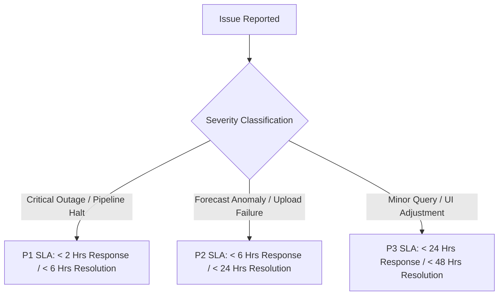

# FineMed Pharma AI — SLA & Support Agreement

**Document Version:** 1.0.0  
**Effective Period:** Included for 6 Months Post-Deployment  
**Client:** FineMed Pharmaceuticals Distribution  

---

## 1. Executive Service Level Commitment

FineMed Pharma AI is an autonomous, AI-driven demand forecasting and inventory analytics system. This agreement defines the Service Level Agreements (SLAs), support response targets, maintenance commitments, and ongoing warranty provided as part of the ₹5–8 Lakh project engagement.

---

## 2. Included Support Period & Coverage

| Service Element | Included Duration | Scope |
|---|---|---|
| **Post-Launch Support** | **6 Months** included in project cost | Technical support, bug fixes, model performance tune-ups. |
| **System Warranty** | **6 Months** | Guaranteed fix for system crashes, data corruption, or API breaks. |
| **Monthly Health Reviews** | **Monthly (6 sessions)** | 45-minute monthly accuracy and forecast alignment review with management. |
| **Model Retraining & Fine-tuning** | **Quarterly** | Re-calibration of Chronos-2 zero-shot & contextual parameters. |

---

## 3. Incident Classification & Response SLAs

When an operational or technical issue occurs, support tickets are classified into three severity levels:

### SLA Matrix

| Priority Level | Definition | Initial Response SLA | Target Resolution SLA |
|---|---|---|---|
| **P1 — Critical** | Main API unavailable, background monthly ETL pipeline crashing, data corruption blocking monthly orders. | **< 2 Hours** | **< 6 Hours** |
| **P2 — High** | Specific medicine forecast producing zero values, alert notification email/webhook dispatch failing. | **< 6 Hours** | **< 24 Hours** |
| **P3 — Normal** | UI cosmetic adjustments, general user questions, staff access key resets. | **< 24 Hours** | **< 48 Hours** |

---

## 4. System Availability & Uptime Guarantee

* **Target Uptime:** **99.5% Monthly Availability** for the FastAPI serving tier (`/forecast`, `/alerts`, `/health`).
* **Maintenance Windows:** Planned maintenance is conducted outside business hours (Sundays 01:00 AM – 04:00 AM IST) with 48 hours prior notice.

---

## 5. Scope of Maintenance & Support

### In-Scope Support
* Fixing bugs in ETL parsing, warehouse generation, forecasting pipeline, or API endpoints.
* Resolving upload failures on monthly dBase `.DAT` files.
* Fine-tuning Alert Engine thresholds (e.g. stockout ratios, demand spike sensitivity).
* Providing assistance with API key rotation and server environment setup.

### Out-of-Scope Items
* Custom feature requests not defined in the original ₹5–8L project scope.
* ERP software database migrations outside standard dBase DBF `.DAT` table formats.
* Provisioning new server infrastructure costs (cloud hosting bills like AWS/GCP/Azure).

---

## 6. Escalation Protocol & Contact Info

* **Primary Technical Lead:** Engineering Support Team (`support@finemedpharma.ai`)
* **Emergency Hotline (P1 Outages):** Dedicated Phone / WhatsApp Support Line
