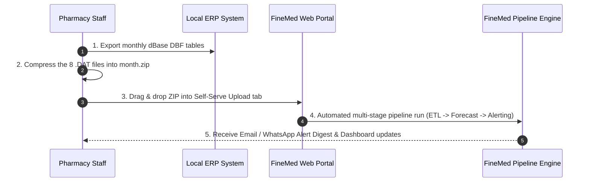

# FineMed Pharma AI — User Guide & Operational Training Manual

**Document Version:** 1.0.0  
**Target Audience:** Founder, Operations Director, Warehouse Managers, Pharmacy Staff  

---

## 1. System Overview & Value Proposition

FineMed Pharma AI automates the complete lifecycle of pharma distribution demand planning:
1. **Self-Serve Monthly Upload:** Zero manual scripts — upload your monthly ERP export in 3 clicks.
2. **AI Demand Forecasting:** 30-day forward demand predictions with P10/P50/P90 confidence bands.
3. **Automated Forecast Evaluation:** Visual proof of forecast accuracy (WAPE/MAE) month-over-month.
4. **Operational Risk Alerts:** Automated notifications for stockouts, demand surges, and expiry risks via Email/WhatsApp.
5. **AI Business Assistant:** Ask natural language questions about medicine sales, trends, and stock allocations.

---

## 2. Monthly Operational Workflow (Step-by-Step)

---

## 3. Step 1: Exporting Data from ERP & Packaging

At the end of every calendar month (or first week of the new month):
1. Open your ERP Software export menu.
2. Export the monthly database tables to a folder. Ensure the following **8 required `.DAT` files** are present:
   * `INVOICE.DAT` — Sales invoice headers
   * `INVDET.DAT` — Itemized sales lines
   * `MEDIMAST.DAT` — Medicine catalog
   * `PURCHASE.DAT` — Purchase invoice line items
   * `COMPUR.DAT` — Purchase invoice headers
   * `SUPMAST.DAT` — Supplier catalog
   * `SFILE.DAT` — Sales representative master
   * `TFILE.DAT` — GST & tax slabs master
3. Right-click the folder and select **Compress to ZIP file** (e.g. `2026-08_Export.zip`).

---

## 4. Step 2: Uploading via the Self-Serve Web Portal

1. Open the FineMed Dashboard in your browser (`https://your-finemed-domain.com`).
2. Click the **Self-Serve Data Upload** tab in the navigation bar.
3. Enter the month identifier (e.g., `2026-08`).
4. Drag and drop `2026-08_Export.zip` onto the upload box (or click to select).
5. Click **Start Full Pipeline Run**.
6. Track live execution progress across all 6 automated stages:
   * **Stage 1 (ETL):** Ingests raw `.DAT` files into consolidated tables.
   * **Stage 2 (Validation):** Audits schema drift and duplicate records.
   * **Stage 3 (Demand Prep):** Constructs continuous daily time-series per medicine.
   * **Stage 4 (Forecasting):** Runs Chronos-2 AI model inference.
   * **Stage 5 (Evaluation):** Measures WAPE/MAE accuracy against actuals.
   * **Stage 6 (Alerting):** Dispatches automated risk alerts.

---

## 5. Step 3: Interpreting Forecasts & Confidence Bands

Navigate to the **Demand Explorer** tab:
* **P50 (Predicted Demand):** Expected baseline sales forecast for the next 30 days. Use this number for standard reorders.
* **P10 (Pessimistic Bound):** Low-demand scenario. If inventory drops below P10, risk of stockout is low.
* **P90 (Optimistic Bound):** High-demand surge scenario. Use P90 to set safety buffer stock for critical life-saving medicines.

---

## 6. Step 4: Acting on Operational Risk Alerts

Navigate to the **Risk Alert Center** tab or check your daily Email digest:

| Alert Severity | Recommended Action |
|---|---|
| **CRITICAL (Stockout Risk)** | Current stock is below 30-day forecasted demand. Place purchase order immediately to avoid stockout. |
| **WARNING (Demand Spike)** | Demand is >50% higher than historical average. Contact suppliers to verify lead time availability. |
| **INFO (High Uncertainty)** | Volatile demand pattern detected. Review weekly sales velocity before placing large orders. |

---

## 7. Step 5: Using the AI Business Assistant

Click the **AI Business Assistant** tab to ask natural language questions:
* *"Which 5 medicines have the highest predicted demand growth next month?"*
* *"What is the 30-day forecast for medicine code 0042?"*
* *"Are there any stockout risks for antibiotic SKU 0110?"*

---

## 8. Staff Training Session Script (15-Minute Outline)

* **00:00 – 03:00:** Overview of the FineMed AI Dashboard & KPI Metrics.
* **03:00 – 07:00:** Live demonstration: Exporting `.DAT` files and uploading `.ZIP` archive.
* **07:00 – 11:00:** How to read P10/P50/P90 demand curves and reorder quantities.
* **11:00 – 15:00:** Reviewing email alert digests and asking questions to the AI Assistant.
